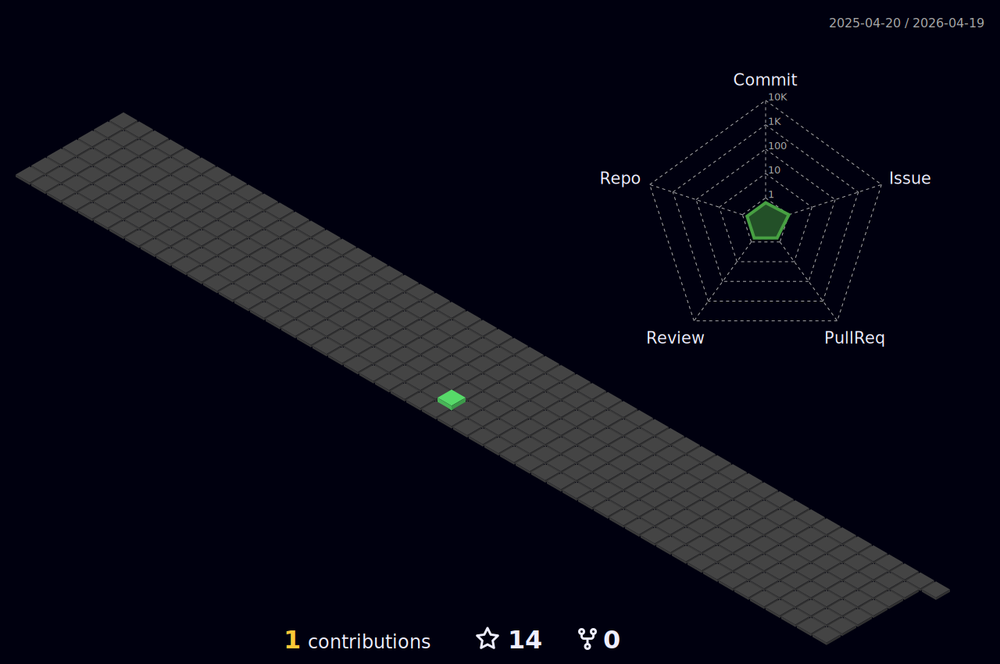

<!-- 

  

 -->

<h2 align="center">Hello, World! 👋</h2>

💻 I'm a Full-Stack Software Engineer from Brazil 🇧🇷, with Italian 🇮🇹 blood, proficient in JavaScript, Node.js, TypeScript, SQL, NoSQL, and React.

🔍 I'm passionate about coding and problem-solving, which fuels my excitement and commitment to every project I take on. 

🌟 I'm an open-source enthusiast. 

🚀 Currently, I'm diving into Java! 

🌿 Curiosities about me: I love hiking, immersing myself in nature, reading books of all kinds to enrich my worldview, and exploring the world whenever I can.

🌐 I firmly believe the future will be fully decentralized.

❓ Ask me about anything! I don't know everything, but I'd love to know more. 

   
    
    
    
    
    
    
    
     
    
     
     
    
     
     
    
    
    
    
    
    
    
    
    
    
    
    
    
    

<h2 align="center">📬 Get in Touch</h2>

  
  

